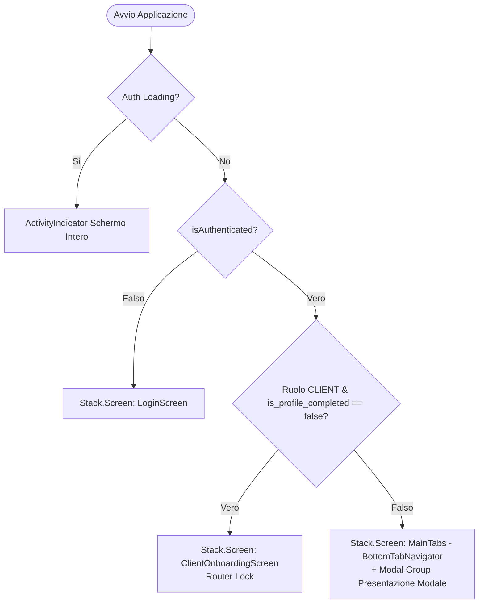
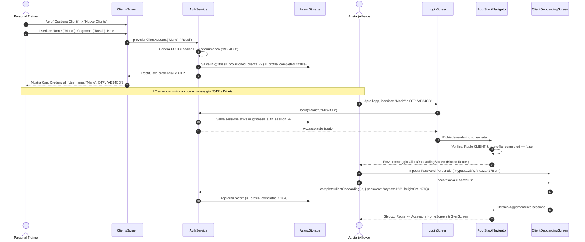

# REPORT DI ANALISI STRUTTURALE DEL SISTEMA
## Progetto: My Train Up (Personal Fitness Logbook Mobile)

> **Data Analisi:** Settembre 2026  
> **Versione Software:** 1.0.0 (Expo SDK 57 / React Native 0.86.3)  
> **Tipo Documento:** System Architecture & Codebase Inspection Report  
> **Oggetto:** Mappatura integrale del frontend, logica di stato, persistenza locale, sicurezza e flussi RBAC derivati dall'ispezione analitica del codice sorgente.

---

## 📌 Indice Generale
1. [Panoramica del Progetto & Scopo Funzionale](#1-panoramica-del-progetto--scopo-funzionale)
2. [Architettura e Componenti (Frontend & UI)](#2-architettura-e-componenti-frontend--ui)
   - [2.1 Struttura e Gerarchia di Bootstrap (`App.tsx`)](#21-struttura-e-gerarchia-di-bootstrap-apptsx)
   - [2.2 Navigazione Reattiva & Router Guards (React Navigation v7)](#22-navigazione-reattiva--router-guards-react-navigation-v7)
   - [2.3 Catalogo Schermate Principali e Schermate Modali](#23-catalogo-schermate-principali-e-schermate-modali)
   - [2.4 Design System Gym Dark & Componenti Condivisi](#24-design-system-gym-dark--componenti-condivisi)
3. [Gestione dello Stato e Logica Applicativa](#3-gestione-dello-stato-e-logica-applicativa)
   - [3.1 AuthContext: Sessioni, Provisioning & Ciclo Vita Utente](#31-authcontext-sessioni-provisioning--ciclo-vita-utente)
   - [3.2 GymContext: Engine Tecnico di Allenamento & Modalità Delegata](#32-gymcontext-engine-tecnico-di-allenamento--modalità-delegata)
   - [3.3 MeasurementContext: Biometria, Delta e Calcolo In-Place](#33-measurementcontext-biometria-delta-e-calcolo-in-place)
   - [3.4 DietContext: Piani Nutrizionali PDF & Mutua Esclusione](#34-dietcontext-piani-nutrizionali-pdf--mutua-esclusione)
4. [Il Sistema di Persistenza (Il "Database" Locale)](#4-il-sistema-di-persistenza-il-database-locale)
   - [4.1 Mappatura Esaustiva delle Chiavi di AsyncStorage](#41-mappatura-esaustiva-delle-chiavi-di-asyncstorage)
   - [4.2 Layer dei Servizi di Storage](#42-layer-dei-servizi-di-storage)
   - [4.3 Auto-Seeding e Resilienza Dati](#43-auto-seeding-e-resilienza-dati)
   - [4.4 Meccanismo di Backup e Ripristino JSON (Schema v3)](#44-meccanismo-di-backup-e-ripristino-json-schema-v3)
5. [Flussi di Sicurezza e Ruoli (RBAC)](#5-flussi-di-sicurezza-e-ruoli-rbac)
   - [5.1 Modello di Accesso Master/Subordinato (`TRAINER` vs `CLIENT`)](#51-modello-di-accesso-mastersubordinato-trainer-vs-client)
   - [5.2 Doppia Modalità di Autenticazione (Password Personale vs OTP Master)](#52-doppia-modalità-di-autenticazione-password-personale-vs-otp-master)
   - [5.3 Onboarding Obbligatorio al Primo Accesso](#53-onboarding-obbligatorio-al-primo-accesso)
   - [5.4 Flusso Operativo Completo di Provisioning Atleta](#54-flusso-operativo-completo-di-provisioning-atleta)

---

## 1. Panoramica del Progetto & Scopo Funzionale

Dall'ispezione analitica del codice sorgente (`App.tsx`, `src/services/`, `src/screens/`, `src/types/`), **My Train Up** si configura come un'applicazione mobile professionale per la gestione completa dell'allenamento con sovraccarichi, del monitoraggio corporeo e della nutrizione, progettata con un'architettura rigorosamente **Offline-First**.

L'applicazione risponde a una duplice esigenza funzionale:
1. **Per il Personal Trainer (`TRAINER`):** Funge da gestionale operativo per censire i propri allievi, generare codici d'accesso immediati, creare e clonare schede di allenamento suddivise in split e cartelle di mesociclo, e assegnarle direttamente ai profili degli atleti (*modalità delega*).
2. **Per l'Atleta in Sala Pesi (`CLIENT`):** Funge da Live Workout Tracker avanzato. L'atleta esegue la scheda assegnata dal preparatore senza rischio di alterarne accidentalmente la struttura, registrando serie per serie carichi effettivi, ripetizioni, RPE, elastici di assistenza e tempi di recupero assistiti da una **sveglia sonora acustica continua** (`alarm.wav`).

### Principi Architetturali Chiave
- **Autonomia Totale Offline:** Nessuna funzionalità vitale (esecuzione workout, cronometri, calcolo tonnellaggio, storico impedenziometrico, consultazione diete PDF) richiede una connessione a Internet attiva.
- **Zero Lock-In & Sovranità dei Dati:** I dati risiedono nella memoria protetta del terminale (`AsyncStorage`) e possono essere esportati o ripristinati istantaneamente in formato JSON standardizzato.

---

## 2. Architettura e Componenti (Frontend & UI)

### 2.1 Struttura e Gerarchia di Bootstrap (`App.tsx`)
Il punto di ingresso (`App.tsx`) orchestra l'albero dei componenti incapsulando l'applicazione in una sequenza precisa di Provider reattivi:

```
[SafeAreaProvider]
  └── [AuthProvider]
        └── [GymProvider]
              └── [MeasurementProvider]
                    └── [DietProvider]
                          └── [AppContent]
                                ├── [StatusBar (light)]
                                └── [NavigationContainer (customDarkTheme)]
                                      ├── [Header (condizionale)]
                                      └── [RootStackNavigator]
```

`AppContent` monitora lo stato di autenticazione e la guardia di onboarding: l'intestazione globale `Header` e lo sfondo primario vengono attivati solo se l'utente è autenticato e non si trova nella fase di onboarding bloccante.

### 2.2 Navigazione Reattiva & Router Guards (React Navigation v7)
La navigazione, implementata con le versioni più recenti di React Navigation (`@react-navigation/native-stack 7.x` e `@react-navigation/bottom-tabs 7.x`), adotta un routing condizionale a livello di root stack (`src/navigation/RootStackNavigator.tsx`):



#### Regole della Router Guard:
- **Stato Non Autenticato:** L'utente ha visibilità esclusiva della schermata `LoginScreen`.
- **Stato Onboarding:** Se l'utente è un `CLIENT` con `is_profile_completed === false`, la root stack monta **unicamente** `ClientOnboardingScreen`. È fisicamente impossibile per l'allievo navigare verso la Home o i tab di sistema senza aver completato il form di primo accesso.
- **Stato Operativo Standard:** Vengono montati i tab applicativi (`MainTabs`) e il gruppo modale con transizione `slide_from_bottom`.

### 2.3 Catalogo Schermate Principali e Schermate Modali

#### A. Schermate su Bottom Tab (`src/screens/`):
1. **`HomeScreen`:** Cruscotto riassuntivo personalizzato con saluto dinamico (`Ciao, [Nome/Username] 👋`), badge del ruolo, card della prossima sessione programmata con anteprima esercizi e statistiche rapide (schede attive, sessioni concluse, ultima pesata).
2. **`GymScreen`:** Il nucleo dell'allenamento. Include:
   - Selettore cartelle mesociclo (es. *Forza*, *Ipertrofia*).
   - Elenco schede con indicazione dei giorni settimanali, volume stimato e pulsanti rapidi (*Avvia Workout*, *Modifica*, *Duplica*, *Elimina*).
   - Banner visivo di **Modalità Delega Attiva** quando il Trainer sta operando per conto di un atleta.
   - Catalogo dei 46 esercizi muscolari con filtro anatomico e video dimostrativi.
   - Cronologia delle sessioni concluse con tonnellaggio e carichi sollevati.
3. **`ClientsScreen` (Visibile ESCLUSIVAMENTE al Trainer):** Dashboard atleti. Gestione allievi attivi e archiviati, generazione nuove credenziali OTP, stato onboarding e delega schede.
4. **`MeasurementsScreen`:** Gestione della composizione corporea con modulo di inserimento/modifica in-place in testa alla schermata, grafico dell'andamento peso e card biometriche storicizzate.
5. **`DietScreen`:** Archivio piani alimentari con distinzione visiva tra *Piano Nutrizionale Attivo* e *Archivio Piani Passati*, con visualizzazione integrata di file PDF tramite Intent di sistema o `expo-sharing`.
6. **`ProfileScreen`:** Anagrafica utente, avatar isolato, riepilogo credenziali, stato associazione Trainer-Cliente e badge di verifica accesso.
7. **`SettingsScreen`:** Gestione del database locale, esportazione/importazione del backup JSON unificato, cancellazione mirata o reset di emergenza dell'applicazione.

#### B. Schermate Modali di Secondo Livello (`src/screens/modals/`):
- **`WorkoutModal`:** Il logger live della sessione. Gestisce l'inserimento dinamico di serie, carichi, reps, RPE, timer di riposo con conto alla rovescia, overlay timer a tutto schermo e attivazione dell'allarme in loop al termine del recupero.
- **`NewRoutineModal`:** Builder completo di schede di allenamento, supporto a split multi-giornalieri, selezione multipla esercizi, impostazione tecniche speciali (Stripping/Dropset e Rest-Pause).
- **`MeasurementModal`:** Modale specializzato per l'acquisizione dettagliata di valori plicometrici e circonferenze.
- **`UploadDietModal`:** Integrazione con `expo-document-picker` per selezionare e importare file PDF nutrizionali.
- **`ExerciseModal`:** Form per la creazione di esercizi personalizzati da aggiungere al catalogo.
- **`NewClientModal`:** Dialogo guidato per il Trainer per la creazione istantanea del profilo allievo e la generazione della password OTP.

### 2.4 Design System Gym Dark & Componenti Condivisi
L'interfaccia adotta uno schema colori ad alto contrasto denominato **Gym Dark** (`src/theme/colors.ts`), studiato per garantire la massima leggibilità sotto le luci dirette delle palestre:

| Token | Valore Hex | Utilizzo nel Sistema |
|---|---|---|
| `background` / `backgroundSolid` | `#0F172A` (Slate-900) | Sfondo primario delle schermate e delle modali |
| `primary` / `surface` | `#1E293B` (Slate-800) | Superficie di Card, Header e contenitori sopraelevati |
| `backgroundSubtle` / `border` | `#334155` (Slate-700) | Bordi di separazione, input field e divisori |
| `accent` | `#0EA5E9` (Sky-500) | Tasti di azione primaria (CTA), icone attive e focus |
| `emerald` / `success` | `#10B981` (Emerald-500) | Serie completate, progressi positivi e verifiche |
| `warning` | `#F59E0B` (Amber-500) | Badge OTP, avvisi e timer isometria |
| `danger` | `#EF4444` (Rose-500) | Pulsanti di eliminazione, reset e stop allarme |
| `volume` | `#A855F7` (Purple-500) | Metriche di volume e tonnellaggio sollevato |

#### Componenti Chiave Riutilizzabili (`src/components/`):
- **`Header`:** Barra superiore unificata con logo ufficiale, badge del ruolo dell'utente (`TRAINER` / `CLIENT`), indicatore del cliente selezionato in delega e pulsante di Logout protetto da modale di conferma.
- **`ImmersiveTimerOverlay` & `RestTimerWidget`:** Gestori visivi del recupero con sveglia continua (`expo-audio`) e vibrazione.
- **`Avatar`:** Rendering dell'immagine profilo memorizzata su chiave isolata o iniziali stilizzate dell'atleta.
- **`CustomConfirmModal`:** Modale di sicurezza per prevenire cancellazioni accidentali di routine, atleti o dati di sessione.
- **`WeightTrendChart`:** Rappresentazione grafica vettoriale dell'andamento ponderale nel tempo.
- **`BandSelectDropdown`:** Selettore dedicato all'assistenza con elastici (None, Light, Medium, Heavy, Weighted).

---

## 3. Gestione dello Stato e Logica Applicativa

Lo stato globale è gestito tramite **React Context**, suddiviso in 4 domini autonomi ma interconnessi:

```
┌──────────────────────────────────────────────────────────────────┐
│                           REACT CONTEXT                          │
├─────────────────┬────────────────┬────────────────┬──────────────┤
│   AuthContext   │   GymContext   │ MeasurementCtx │ DietContext  │
├─────────────────┼────────────────┼────────────────┼──────────────┤
│ - Sessione      │ - Esercizi (46)│ - Storico pesate│ - PDF Dieta  │
│ - Ruolo RBAC    │ - Schede       │ - Calcolo BMI  │ - Dieta Attiva│
│ - Provisioning  │ - Live Workout │ - Delta Peso   │ - Sharing    │
│ - Onboarding    │ - Tonnellaggio │ - Modifica     │ - Intent     │
│ - Delega Clienti│ - Sovraccarico │   In-Place     │   Launcher   │
└─────────────────┴────────────────┴────────────────┴──────────────┘
```

### 3.1 AuthContext: Sessioni, Provisioning & Ciclo Vita Utente
File: `src/context/AuthContext.tsx`
- **Inizializzazione Reattiva:** All'avvio dell'app esegue `checkInitialSession()`, caricando simultaneamente la sessione salvata (`@fitness_auth_session_v2`) e il registro atleti (`@fitness_provisioned_clients_v2`).
- **Sincronizzazione con `profileService`:** Quando un utente accede, le sue informazioni anagrafiche e il suo avatar isolato vengono sincronizzati automaticamente nel `profileService` per garantire la coerenza dell'intero sistema.
- **Metodi Esposti:**
  * `login(credentials)`: Valida username e password/OTP.
  * `logout()`: Svuota sessione attiva e reimposta i profili a stato iniziale.
  * `createClientAccount(firstName, lastName, notes)`: Genera un nuovo allievo con OTP casuale a 6 caratteri.
  * `completeClientOnboarding(data)`: Finalizza la password, altezza e data di nascita dell'atleta.
  * `archiveClient(id)` / `unarchiveClient(id)`: Soft-delete e ripristino dell'allievo.
  * `hardDeleteClient(id)`: Rimozione fisica definitiva dal database locale.

### 3.2 GymContext: Engine Tecnico di Allenamento & Modalità Delegata
File: `src/context/GymContext.tsx` (circa 730 righe di logica ingegneristica).
- **Gestione Esercizi:** Mantiene in memoria il catalogo dei 46 esercizi anatomici predefiniti e le relative personalizzazioni.
- **Logica della "Modalità Delega" (Delegated Mode):**
  * Quando il Trainer seleziona un allievo dall'elenco (`selectedClient`), la proprietà `activeOwnerId` assume il valore dell'ID dell'allievo.
  * Le funzioni `filteredRoutines` e `filteredFolders` filtrano istantaneamente l'interfaccia: il Trainer vede e modifica **esclusivamente** le schede dell'allievo selezionato.
  * Se il Trainer deseleziona l'allievo, la visualizzazione torna alle schede personali del preparatore (`trainer-1`).
  * Quando accede l'atleta (`CLIENT`), `activeOwnerId` è bloccato sul proprio ID: l'allievo vede solo ed esclusivamente il proprio piano di allenamento.
- **Motore di Sovraccarico Progressivo (Progressive Overload Engine):**
  * `getLastPerformance(exerciseId)`: Ispeziona le sessioni passate ed estrae l'ultima prestazione registrata (carico massimo, serie svolte, volume).
  * `getPreviousPerformanceForExercise(exerciseId)`: Fornisce all'atleta durante il Live Workout il confronto esatto serie per serie con l'ultimo allenamento, mostrando carichi e ripetizioni da battere.
  * `getExerciseProgression(exerciseId)`: Calcola record personali (PR su carico singolo e record su volume totale).
- **Calcolo del Volume per Tecniche Intensive:**
  * `calculateSetVolume()` gestisce set standard, stripping (sommando il carico base e tutti i drop successivi) e rest-pause.

### 3.3 MeasurementContext: Biometria, Delta e Calcolo In-Place
File: `src/context/MeasurementContext.tsx`
- Gestisce la sequenza cronologica delle pesate dell'atleta (`@measurements_v3`).
- Calcola in automatico:
  * **Differenziale di Peso (`weight_delta_kg`):** Confronto immediato con la pesata temporalmente precedente (`Δ kg`).
  * **Indice di Massa Corporea (`BMI`):** Calcolato dividendo il peso per il quadrato dell'altezza registrata nel profilo dell'atleta.
- Supporta la modifica in-place senza schermate intermedie: toccando una misurazione passata, il modulo superiore si precompila e permette l'aggiornamento immediato.

### 3.4 DietContext: Piani Nutrizionali PDF & Mutua Esclusione
File: `src/context/DietContext.tsx`
- Gestisce i metadati dei documenti PDF memorizzati nel filesystem locale (`@diets_v3`).
- **Regola di Mutua Esclusione:** L'attivazione di una dieta (`setActiveDiet(id)`) disattiva automaticamente tutte le altre diete presenti nello storico (`is_active: 0`), garantendo che ci sia sempre al massimo un unico piano nutrizionale attivo contemporaneamente.
- Gestisce l'eliminazione del record e il disaccoppiamento dei file.

---

## 4. Il Sistema di Persistenza (Il "Database" Locale)

L'applicazione utilizza `@react-native-async-storage/async-storage` come motore di archiviazione NoSQL a documenti chiave-valore.

### 4.1 Mappatura Esaustiva delle Chiavi di AsyncStorage

| Chiave Storage | Modello Dati / TypeScript | Descrizione e Contenuto |
|---|---|---|
| `@fitness_auth_session_v2` | `AuthSession` | Contiene l'oggetto `user` loggato e il token JWT simulato di sessione. |
| `@fitness_provisioned_clients_v2` | `ProvisionedClient[]` | Elenco di tutti gli allievi creati dal Trainer, inclusi OTP, password e stato onboarding. |
| `@user_profile_v3` | `UserProfile` | Profilo attivo per il motore anagrafico e i selettori di ruolo. |
| `@avatar_${userId}` | `string` (file URI) | Chiave isolata per singolo utente contenente il path locale della foto profilo. |
| `@gym_exercises_v2` | `Exercise[]` | Catalogo dei 46 esercizi muscolari standardizzati con gruppi, tipologia e note. |
| `@gym_routines_v3` | `WorkoutRoutine[]` | Tutte le schede create (sia del Trainer sia assegnate a ciascun allievo tramite `owner_id`). |
| `@gym_workouts_v3` | `Workout[]` | Storico di tutti gli allenamenti completati, carichi registrati ed RPE. |
| `@gym_folders_v3` | `RoutineFolder[]` | Cartelle organizzative dei mesocicli con associazione a `owner_id`. |
| `@measurements_v3` | `BodyMeasurement[]` | Storico misurazioni impedenziometriche e pesate corporee. |
| `@diets_v3` | `DietPdf[]` | Registro dei piani nutrizionali PDF caricati. |
| `@fitness_active_otps_v1` | `ActiveOtpRecord[]` | Codici temporanei per l'accoppiamento tra terminali via API. |

### 4.2 Layer dei Servizi di Storage
La persistenza è incapsulata in servizi dedicati e non viene mai invocata disordinatamente dai componenti UI:
- `authService.ts`: Gestione sessione e catalogo allievi.
- `profileService.ts`: Gestore anagrafico reattivo con pattern Observer (`subscribe`/`notifyListeners`) per notificare i componenti al cambio utente o avatar.
- `gymStorage.ts`: CRUD per schede, esercizi, sessioni e cartelle.
- `measurementStorage.ts`: Logica di calcolo e serializzazione biometrica.
- `dietStorage.ts`: Gestione stato e metadata dei documenti nutrizionali.
- `backupService.ts`: Motore di import/export globale.

### 4.3 Auto-Seeding e Resilienza Dati
Al primo avvio su un dispositivo vergine, l'app esegue l'auto-seeding controllato:
- Se la chiave `@gym_exercises_v2` risulta vuota, carica automaticamente i 46 esercizi predefiniti da `src/data/defaultExercises.ts`.
- Se la chiave `@gym_routines_v3` risulta vuota, predispone le schede demo iniziali.
- In caso di corruzione del JSON salvato, ogni metodo include blocchi `try/catch` con fallback immediato su array vuoti o configurazioni sicure, impedendo il crash dell'applicazione.

### 4.4 Meccanismo di Backup e Ripristino JSON (Schema v3)
File: `src/services/backupService.ts`
L'intero database locale può essere esportato in un unico archivio JSON unificato (`FullBackupPayload` con `schemaVersion: 3`):

```json
{
  "schemaVersion": 3,
  "exportDate": "2026-09-17T14:00:00.000Z",
  "appName": "MyTrainUp",
  "stats": {
    "routinesCount": 4,
    "workoutsCount": 12,
    "foldersCount": 2,
    "exercisesCount": 46,
    "measurementsCount": 8,
    "dietsCount": 1,
    "clientsCount": 3
  },
  "data": {
    "profile": { ... },
    "provisionedClients": [ ... ],
    "routines": [ ... ],
    "workouts": [ ... ],
    "folders": [ ... ],
    "exercises": [ ... ],
    "measurements": [ ... ],
    "diets": [ ... ]
  }
}
```

- **Esportazione:** Utilizza `expo-file-system` per scrivere il file temporaneo nella cache del dispositivo e `expo-sharing` per aprire il foglio di condivisione nativo (invio via email, WhatsApp, salvataggio su Drive o file system).
- **Importazione a Caldo:** Include un validatore di schema che verifica la presenza di `schemaVersion` e la struttura dei dati prima di sovrascrivere AsyncStorage, ricaricando all'istante tutti i contesti React senza richiedere il riavvio manuale dell'app.

---

## 5. Flussi di Sicurezza e Ruoli (RBAC)

### 5.1 Modello di Accesso Master/Subordinato (`TRAINER` vs `CLIENT`)
Il controllo degli accessi è implementato in modo granulare:

```
                  ┌──────────────────────────────┐
                  │       SISTEMA DI RUOLI       │
                  └──────────────┬───────────────┘
                                 │
         ┌───────────────────────┴───────────────────────┐
         ▼                                               ▼
  Ruolo TRAINER (Master)                          Ruolo CLIENT (Allievo)
  ├── Gestione Clienti abilitata                  ├── Tab Clienti NASCOSTO
  ├── Creazione schede per terzi (Delega)         ├── Schede di sola esecuzione
  ├── Accesso a tutte le cartelle mesociclo       ├── Nessuna modifica a split/esercizi
  └── Visualizzazione storico atleti              └── Profilo con indicazione del Trainer
```

- **In `BottomTabNavigator.tsx`:** Il tab `ClientsScreen` viene rimosso dall'albero di rendering se il ruolo è diverso da `TRAINER`.
- **In `GymScreen.tsx`:** I comandi di creazione, modifica ed eliminazione delle schede vengono regolati in base al ruolo; l'allievo dispone del pulsante primario *"Avvia Workout"* senza facoltà di stravolgere la programmazione stabilita dal preparatore.

### 5.2 Doppia Modalità di Autenticazione (Password Personale vs OTP Master)
File: `src/services/authService.ts` -> funzione `login()`

Per eliminare il problema del recupero password in ambiente offline:
1. **Credenziali Master Trainer:**
   - Configurabili tramite file `.env` (`EXPO_PUBLIC_TRAINER_USERNAME` e `EXPO_PUBLIC_TRAINER_PASSWORD`) con fallback su credenziali standard.
2. **Autenticazione Flessibile per l'Allievo:**
   - L'atleta può autenticarsi inserendo il proprio **Username** (o Nome, Cognome, Email) unito a:
     * **Opzione A: La propria Password Personale** (impostata dall'utente durante l'onboarding).
     * **Opzione B: Il Codice OTP Originario** (rilasciato dal Trainer in fase di creazione).
   - **L'OTP funge da Master Key Perpetua:** se l'atleta dimentica la propria password personale, non rimane mai bloccato fuori dall'app, potendo accedere in qualsiasi momento con il codice OTP fornitogli originariamente dal proprio Trainer.

### 5.3 Onboarding Obbligatorio al Primo Accesso
Quando il Trainer crea un account allievo, il record viene inizializzato con:
```typescript
{
  is_profile_completed: false,
  raw_otp: "X7K9P2",
  password: ""
}
```

Al primo accesso dell'atleta con l'OTP:
1. `RootStackNavigator` rileva la condizione `user.role === 'CLIENT' && user.is_profile_completed === false`.
2. La navigazione verso i tab ordinari viene **bloccata**. L'app presenta a schermo intero `ClientOnboardingScreen`.
3. L'atleta visualizza i propri dati anagrafici (Nome, Cognome e Trainer di riferimento) e deve obbligatoriamente:
   - Impostare la propria **Nuova Password Personale**.
   - Definire un **Username personalizzato** facoltativo.
   - Confermare data di nascita e altezza corporea (utilizzata per il calcolo del BMI).
4. Alla pressione di *"Salva e Accedi ➔"*, il flag `is_profile_completed` viene commutato a `true`, la sessione viene ri-serializzata e la root stack sblocca l'accesso a `MainTabs`.

### 5.4 Flusso Operativo Completo di Provisioning Atleta



---

## 6. Conclusioni dell'Analisi

L'analisi del codice sorgente dimostra che **My Train Up** è un'architettura completa, solida e matura:
1. **Separazione delle Responsabilità Eccellente:** Netta demarcazione tra layer di presentazione (Screens/Modals), logica di coordinamento reattivo (Context Providers) e strato di astrazione della persistenza (Services).
2. **Robustezza Offline-First Comprovata:** La totale indipendenza da server remoti garantisce affidabilità estrema sul campo (sala pesi).
3. **Predisposizione Naturale alla Migrazione Cloud:** Il modello dati già fortemente tipizzato in TypeScript, i DTO strutturati in `src/types/api.ts` e la centralizzazione dei contratti di storage rendono l'app immediatamente pronta per l'aggancio a un backend RESTful e a una sincronizzazione remota su database PostgreSQL.

---

*Report generato in modo autonomo a seguito di ispezione del codice sorgente del repository.*  
*My Train Up © 2026 - Lorenzo Anzivino.*
